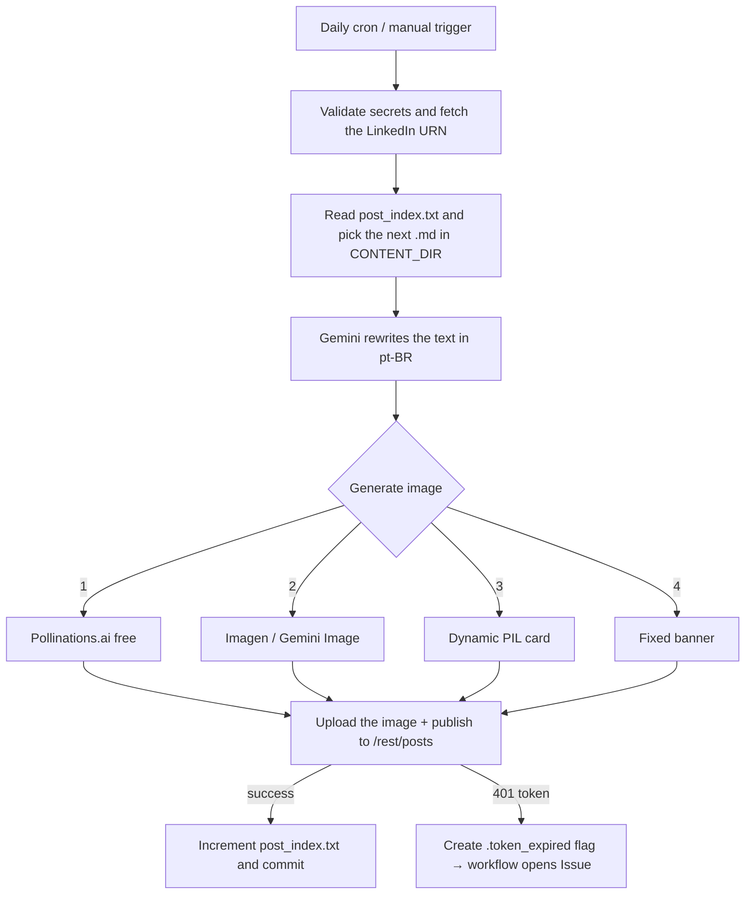

<!-- ══════════════════════ IDIOMAS / LANGUAGES ══════════════════════ -->
<div align="center">
<a href="README.md"></a>
<a href="README.en.md"></a>
<a href="README.es.md"></a>
</div>

<!-- ══════════════════════════ BANNER ══════════════════════════ -->
<div align="center">
  
</div>

<div align="center">
  
</div>

<div align="center">
  
</div>

<br/>

<h1 align="center">LinkedIn Post Automation</h1>
<p align="center"><em>One post per day on LinkedIn, 100% autonomous — from Markdown to publication, serverless and free</em></p>
<p align="center"><strong>.md note → Gemini rewrites → AI image → LinkedIn API</strong></p>

<div align="center">


<br/>


</div>

<!-- ══════════════════════════ NAVEGAÇÃO ══════════════════════════ -->
<div align="center">

<a href="#about"></a>
<a href="#how-it-works"></a>
<a href="#technologies"></a>
<a href="#configuration"></a>
<a href="#usage"></a>

</div>

<br/>

> 💡 **Zero infrastructure.** Runs entirely on **GitHub Actions** (daily cron + manual trigger) — serverless, free, no manual intervention. Point the `CONTENT_DIR` variable at any folder of `.md` files and the engine starts posting your content.

<!-- ══════════════════════════ SOBRE ══════════════════════════ -->
## About

Publishes **one post per day on LinkedIn** autonomously, straight from GitHub Actions. The tool takes Markdown notes, **rewrites the text with AI** (Google Gemini) in a professional tone and in Brazilian Portuguese, **generates an AI cover image** (with a cascade of fallbacks so it never fails) and **publishes through the official LinkedIn API** — all scheduled by a cron.

It was built to publish daily notes from a graduate program in Information Security, but the engine is **generic**: any folder of `.md` files becomes a queue of posts.

<!-- ══════════════════════════ DESTAQUES ══════════════════════════ -->
## Engineering Highlights

| Feature | What it does |
|---|---|
| **AI rewriting** | Gemini (`gemini-2.5-flash`) turns the note into a LinkedIn post — the prompt enforces pt-BR, strips markdown/emojis and the "AI look" |
| **AI image with cascading fallback** | 4 strategies so the post **always** ships with a cover |
| **Resilience to transient failures** | Retry with exponential *backoff*; distinguishes a transient error (503/429 → retry) from a permanent one (quota/paid plan → falls back) |
| **Versioned state** | `post_index.txt` stores the index of the next post; it advances on every publication and is committed by the workflow itself — impossible to get out of sync |
| **Token management** | The LinkedIn access token lasts ~60 days and has no refresh; when it expires, the workflow **opens an Issue** as a reminder |
| **`dry_run` mode** | Assembles the entire post (text + image + payload) and **does not publish**, so you can validate safely |

**Image cascade** (from best to most resilient — the post never ships without a cover):

1. **Pollinations.ai** — free AI, no API key (primary source)
2. **Imagen / Gemini Image** — when billing is enabled
3. **Dynamic card with PIL** — gradient and color varying per post
4. **Fixed brand banner** — `assets/post_fallback.png`

<!-- ══════════════════════════ COMO FUNCIONA ══════════════════════════ -->
## How It Works



**Detailed flow:**

1. Validates the secrets and calls `GET /v2/userinfo` to build the author URN (detects an expired token via 401).
2. Reads `post_index.txt` and scans `CONTENT_DIR` (`os.walk`) for the next `.md` — a **circular** index (when the list ends, it starts over).
3. Sends the content to **Gemini**, which rewrites it as a LinkedIn post (hook, bullets, CTA, 3 hashtags, ≤1300 characters, no emojis/markdown).
4. Generates the cover image via the **fallback cascade**.
5. Uploads the image (`/rest/images` → `initializeUpload` → binary `PUT`) and publishes to **`/rest/posts`**.
6. On success, it increments and commits `post_index.txt`.

<!-- ══════════════════════════ TECNOLOGIAS ══════════════════════════ -->
## Technologies

<div>


</div>

| Layer | Technology |
|---|---|
| Language | Python 3.11 |
| Orchestration | GitHub Actions (cron + `workflow_dispatch`) |
| Text rewriting | Google Gemini (`google-genai`) |
| AI image | Pollinations.ai · Imagen/Gemini Image |
| Fallback image | Pillow (PIL) |
| Publishing | LinkedIn Posts API (`/rest/posts`) |
| HTTP | `requests` |

Dependencies in [`requirements.txt`](requirements.txt): `google-genai`, `requests`, `Pillow`.

<!-- ══════════════════════════ CONFIGURAÇÃO ══════════════════════════ -->
## Configuration

**1. Secrets (required)** — under **Settings → Secrets and variables → Actions**:

| Secret | Where to get it |
|---|---|
| `GEMINI_API_KEY` | [Google AI Studio](https://aistudio.google.com/app/apikey) |
| `LINKEDIN_ACCESS_TOKEN` | [LinkedIn OAuth Token Generator](https://www.linkedin.com/developers/tools/oauth/token-generator) — scopes `openid`, `profile`, `w_member_social` |

**2. Optional variables (with defaults):**

| Variable | Default | Purpose |
|---|---|---|
| `CONTENT_DIR` | `content` | Root folder scanned for the `.md` files |
| `GEMINI_TEXT_MODEL` | `gemini-2.5-flash` | Text rewriting model |
| `USE_POLLINATIONS` | `1` | Uses Pollinations.ai as the primary image source |
| `POLLINATIONS_MODEL` | `flux` | Pollinations model (`flux`, `turbo`, …) |
| `DRY_RUN` | `0` | `1` = assembles everything but **does not** publish |
| `LINKEDIN_VERSION` | `202606` | LinkedIn API version |
| `GEMINI_RETRY_MAX` / `_IMG` / `_BASE` | `5` / `3` / `2.0` | Retry-with-backoff parameters |

**3. Content** — drop your `.md` files into `content/` (or point `CONTENT_DIR` at another folder). Subfolders are scanned recursively.

<!-- ══════════════════════════ USO ══════════════════════════ -->
## Usage

**Automatic:** the workflow runs daily at **20:23 UTC (~17:23 BRT)** — configurable in [`.github/workflows/post_diario.yml`](.github/workflows/post_diario.yml).

**Manual / test (does not publish):**
```bash
gh workflow run post_diario.yml --ref main -f dry_run=true
```

**Local (does not publish):**
```bash
pip install -r requirements.txt
DRY_RUN=1 CONTENT_DIR=content \
GEMINI_API_KEY="..." LINKEDIN_ACCESS_TOKEN="..." \
python automacao_linkedin.py
```

<!-- ══════════════════════════ TOKEN ══════════════════════════ -->
## About the LinkedIn Token

LinkedIn personal-profile apps **do not issue a refresh token**, so the access token (valid for ~60 days) is used directly. When it expires, the script creates the `.token_expired` flag and the workflow **opens an Issue** as a reminder — just generate a new token and update the `LINKEDIN_ACCESS_TOKEN` secret.

<!-- ══════════════════════════ LICENÇA ══════════════════════════ -->
## License

[MIT](LICENSE).

<div align="center">
  
</div>

<p align="center"><sub>Built by <strong><a href="https://github.com/douglascshun">Douglas Cshunderlick</a></strong> (r4bbi7) · Information Security · 2026</sub></p>
