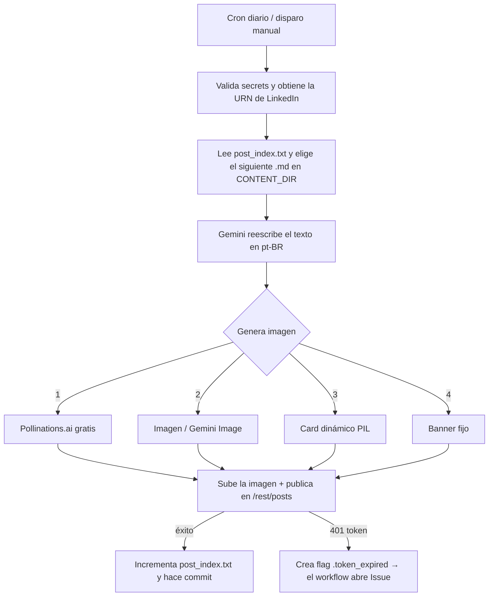

<!-- ══════════════════════ IDIOMAS / LANGUAGES ══════════════════════ -->
<div align="center">
<a href="README.md"></a>
<a href="README.en.md"></a>
<a href="README.es.md"></a>
</div>

<!-- ══════════════════════════ BANNER ══════════════════════════ -->
<div align="center">
  
</div>

<div align="center">
  
</div>

<div align="center">
  
</div>

<br/>

<h1 align="center">Automatización de Publicaciones en LinkedIn</h1>
<p align="center"><em>Una publicación al día en LinkedIn, 100% autónoma — del Markdown a la publicación, sin servidor y sin coste</em></p>
<p align="center"><strong>Nota .md → Gemini reescribe → imagen por IA → LinkedIn API</strong></p>

<div align="center">


<br/>


</div>

<!-- ══════════════════════════ NAVEGACIÓN ══════════════════════════ -->
<div align="center">

<a href="#acerca"></a>
<a href="#cómo-funciona"></a>
<a href="#tecnologías"></a>
<a href="#configuración"></a>
<a href="#uso"></a>

</div>

<br/>

> 💡 **Cero infraestructura.** Se ejecuta íntegramente en **GitHub Actions** (cron diario + disparo manual) — sin servidor, sin coste, sin intervención manual. Apunta la variable `CONTENT_DIR` a cualquier carpeta de archivos `.md` y el motor comienza a publicar tu contenido.

<!-- ══════════════════════════ ACERCA ══════════════════════════ -->
## Acerca

Publica **una publicación al día en LinkedIn** de forma autónoma, directamente desde GitHub Actions. La herramienta toma notas en Markdown, **reescribe el texto con IA** (Google Gemini) con un tono profesional y en portugués de Brasil, **genera una imagen de portada por IA** (con una cascada de fallbacks para no fallar nunca) y **publica mediante la API oficial de LinkedIn** — todo programado por un cron.

Fue creada para difundir a diario las notas del posgrado en Seguridad de la Información, pero el motor es **genérico**: cualquier carpeta de `.md` se convierte en una cola de publicaciones.

<!-- ══════════════════════════ ASPECTOS DESTACADOS ══════════════════════════ -->
## Aspectos Técnicos Destacados

| Recurso | Qué hace |
|---|---|
| **Reescritura con IA** | Gemini (`gemini-2.5-flash`) transforma la nota en una publicación de LinkedIn — el prompt fuerza pt-BR, elimina markdown/emojis y la "cara de IA" |
| **Imagen por IA con fallback en cascada** | 4 estrategias para que la publicación **siempre** salga con portada |
| **Resiliencia ante fallos transitorios** | Reintentos con *backoff* exponencial; distingue error transitorio (503/429 → reintenta) de permanente (cuota/plan de pago → cae en el fallback) |
| **Estado versionado** | `post_index.txt` guarda el índice de la siguiente publicación; avanza en cada publicación y es confirmado por el propio workflow — imposible desincronizar |
| **Gestión del token** | El access token de LinkedIn dura ~60 días y no tiene refresh; al expirar, el workflow **abre una Issue** de recordatorio |
| **Modo `dry_run`** | Monta la publicación completa (texto + imagen + payload) y **no publica**, para validar con seguridad |

**Cascada de imagen** (de la mejor a la más resiliente — la publicación nunca sale sin portada):

1. **Pollinations.ai** — IA gratuita, sin API key (fuente primaria)
2. **Imagen / Gemini Image** — cuando hay billing
3. **Card dinámico con PIL** — gradiente y color que varían por publicación
4. **Banner fijo de marca** — `assets/post_fallback.png`

<!-- ══════════════════════════ CÓMO FUNCIONA ══════════════════════════ -->
## Cómo Funciona



**Flujo detallado:**

1. Valida los secrets y llama a `GET /v2/userinfo` para montar la URN del autor (detecta token expirado mediante 401).
2. Lee `post_index.txt` y recorre `CONTENT_DIR` (`os.walk`) en busca del siguiente `.md` — índice **circular** (al terminar la lista, vuelve a empezar).
3. Envía el contenido a **Gemini**, que lo reescribe como publicación de LinkedIn (hook, bullets, CTA, 3 hashtags, ≤1300 caracteres, sin emojis/markdown).
4. Genera la imagen de portada mediante la **cascada de fallback**.
5. Sube la imagen (`/rest/images` → `initializeUpload` → `PUT` binario) y publica en **`/rest/posts`**.
6. En caso de éxito, incrementa y confirma `post_index.txt`.

<!-- ══════════════════════════ TECNOLOGÍAS ══════════════════════════ -->
## Tecnologías

<div>


</div>

| Capa | Tecnología |
|---|---|
| Lenguaje | Python 3.11 |
| Orquestación | GitHub Actions (cron + `workflow_dispatch`) |
| Reescritura de texto | Google Gemini (`google-genai`) |
| Imagen por IA | Pollinations.ai · Imagen/Gemini Image |
| Imagen fallback | Pillow (PIL) |
| Publicación | LinkedIn Posts API (`/rest/posts`) |
| HTTP | `requests` |

Dependencias en [`requirements.txt`](requirements.txt): `google-genai`, `requests`, `Pillow`.

<!-- ══════════════════════════ CONFIGURACIÓN ══════════════════════════ -->
## Configuración

**1. Secrets (obligatorios)** — en **Settings → Secrets and variables → Actions**:

| Secret | Dónde obtenerlo |
|---|---|
| `GEMINI_API_KEY` | [Google AI Studio](https://aistudio.google.com/app/apikey) |
| `LINKEDIN_ACCESS_TOKEN` | [LinkedIn OAuth Token Generator](https://www.linkedin.com/developers/tools/oauth/token-generator) — scopes `openid`, `profile`, `w_member_social` |

**2. Variables opcionales (con defaults):**

| Variable | Default | Función |
|---|---|---|
| `CONTENT_DIR` | `content` | Carpeta raíz que se recorre en busca de los `.md` |
| `GEMINI_TEXT_MODEL` | `gemini-2.5-flash` | Modelo de reescritura de texto |
| `USE_POLLINATIONS` | `1` | Usa Pollinations.ai como fuente primaria de imagen |
| `POLLINATIONS_MODEL` | `flux` | Modelo de Pollinations (`flux`, `turbo`, …) |
| `DRY_RUN` | `0` | `1` = monta todo pero **no** publica |
| `LINKEDIN_VERSION` | `202606` | Versión de la LinkedIn API |
| `GEMINI_RETRY_MAX` / `_IMG` / `_BASE` | `5` / `3` / `2.0` | Parámetros del retry con backoff |

**3. Contenido** — coloca tus archivos `.md` en `content/` (o apunta `CONTENT_DIR` a otra carpeta). Las subcarpetas se recorren recursivamente.

<!-- ══════════════════════════ USO ══════════════════════════ -->
## Uso

**Automático:** el workflow se ejecuta a diario a las **20:23 UTC (~17:23 BRT)** — configurable en [`.github/workflows/post_diario.yml`](.github/workflows/post_diario.yml).

**Manual / prueba (no publica):**
```bash
gh workflow run post_diario.yml --ref main -f dry_run=true
```

**Local (no publica):**
```bash
pip install -r requirements.txt
DRY_RUN=1 CONTENT_DIR=content \
GEMINI_API_KEY="..." LINKEDIN_ACCESS_TOKEN="..." \
python automacao_linkedin.py
```

<!-- ══════════════════════════ TOKEN ══════════════════════════ -->
## Sobre el Token de LinkedIn

Las apps de perfil personal de LinkedIn **no emiten refresh token**, por lo que el access token (validez ~60 días) se usa directamente. Cuando expira, el script crea la flag `.token_expired` y el workflow **abre una Issue** de recordatorio — basta con generar un nuevo token y actualizar el secret `LINKEDIN_ACCESS_TOKEN`.

<!-- ══════════════════════════ LICENCIA ══════════════════════════ -->
## Licencia

[MIT](LICENSE).

<div align="center">
  
</div>

<p align="center"><sub>Desarrollado por <strong><a href="https://github.com/douglascshun">Douglas Cshunderlick</a></strong> (r4bbi7) · Seguridad de la Información · 2026</sub></p>
