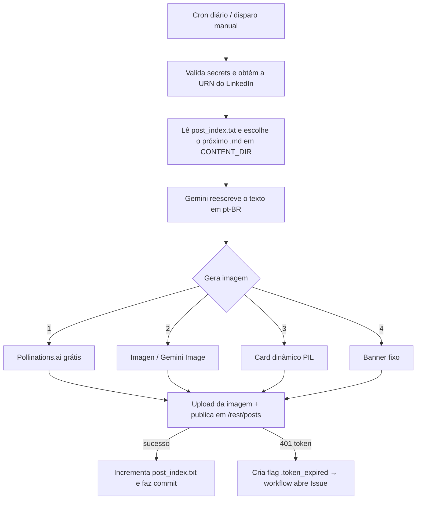

# 🤖 Automação de Posts no LinkedIn

Publica **um post por dia no LinkedIn** de forma 100% autônoma, direto do GitHub Actions — sem servidor, sem custo de infraestrutura e sem intervenção manual.

A ferramenta pega anotações em Markdown, **reescreve o texto com IA** (Google Gemini) num tom profissional e em português do Brasil, **gera uma imagem de capa por IA** (com uma cascata de fallbacks para nunca falhar) e **publica pela API oficial do LinkedIn** — tudo agendado por um cron.

Foi criada para divulgar diariamente minhas anotações da pós em Segurança da Informação, mas o motor é **genérico**: aponte a variável `CONTENT_DIR` para qualquer pasta de arquivos `.md` e ela passa a postar o seu conteúdo.

---

## ✨ Destaques de engenharia

- **Zero infraestrutura** — roda inteiramente no GitHub Actions (cron diário + disparo manual).
- **Reescrita com IA** — Gemini (`gemini-2.5-flash`) transforma a anotação em post de LinkedIn, com prompt que força pt-BR, remove markdown/emojis e "cara de IA".
- **Imagem por IA com fallback em cascata** — 4 estratégias, da melhor à mais resiliente, para o post **sempre** sair com capa:
  1. **Pollinations.ai** (IA gratuita, sem API key) — fonte primária
  2. **Imagen / Gemini Image** (quando há billing)
  3. **Card dinâmico gerado com PIL** (gradiente e cor variando por post)
  4. **Banner fixo de marca** (`assets/post_fallback.png`)
- **Resiliência a falhas transitórias** — retry com *backoff* exponencial que distingue erro **transitório** (503/429 → tenta de novo) de **permanente** (cota zerada/plano pago → desiste rápido e cai no fallback).
- **Estado versionado** — `post_index.txt` guarda o índice do próximo post; avança a cada publicação e é commitado de volta pelo próprio workflow (impossível dessincronizar).
- **Gestão do token** — o access token do LinkedIn dura ~60 dias e **não tem refresh**. Ao expirar, o script sinaliza e o workflow **abre uma Issue** de lembrete automaticamente.
- **Modo `dry_run`** — monta o post inteiro (texto + imagem + payload) e **não publica**, para validar com segurança.

---

## 🗺️ Como funciona



**Fluxo detalhado:**
1. Valida os secrets e chama `GET /v2/userinfo` para montar a URN do autor (detecta token expirado via 401).
2. Lê `post_index.txt` e varre `CONTENT_DIR` (`os.walk`) em busca do próximo `.md` — índice **circular** (ao terminar a lista, recomeça).
3. Envia o conteúdo ao **Gemini**, que reescreve como post de LinkedIn (hook, bullets, CTA, 3 hashtags, ≤1300 caracteres, sem emojis/markdown).
4. Gera a imagem de capa pela **cascata de fallback**.
5. Faz o upload da imagem (`/rest/images` → `initializeUpload` → `PUT` binário) e publica em **`/rest/posts`**.
6. Em caso de sucesso, incrementa e commita `post_index.txt`.

---

## 🧰 Stack

| Camada | Tecnologia |
|---|---|
| Linguagem | Python 3.11 |
| Orquestração | GitHub Actions (cron + `workflow_dispatch`) |
| Reescrita de texto | Google Gemini (`google-genai`) |
| Imagem por IA | Pollinations.ai · Imagen/Gemini Image |
| Imagem fallback | Pillow (PIL) |
| Publicação | LinkedIn Posts API (`/rest/posts`) |
| HTTP | `requests` |

Dependências em [`requirements.txt`](requirements.txt): `google-genai`, `requests`, `Pillow`.

---

## ⚙️ Configuração

### 1. Secrets (obrigatórios)
No repositório, em **Settings → Secrets and variables → Actions**:

| Secret | Onde obter |
|---|---|
| `GEMINI_API_KEY` | [Google AI Studio](https://aistudio.google.com/app/apikey) |
| `LINKEDIN_ACCESS_TOKEN` | [LinkedIn OAuth Token Generator](https://www.linkedin.com/developers/tools/oauth/token-generator) — escopos `openid`, `profile`, `w_member_social` |

### 2. Variáveis opcionais (com defaults)

| Variável | Default | Função |
|---|---|---|
| `CONTENT_DIR` | `content` | Pasta raiz varrida em busca dos `.md` |
| `GEMINI_TEXT_MODEL` | `gemini-2.5-flash` | Modelo de reescrita de texto |
| `USE_POLLINATIONS` | `1` | Usa o Pollinations.ai como fonte primária de imagem |
| `POLLINATIONS_MODEL` | `flux` | Modelo do Pollinations (`flux`, `turbo`, …) |
| `DRY_RUN` | `0` | `1` = monta tudo mas **não** publica |
| `LINKEDIN_VERSION` | `202606` | Versão da LinkedIn API |
| `GEMINI_RETRY_MAX` / `_IMG` / `_BASE` | `5` / `3` / `2.0` | Parâmetros do retry com backoff |

### 3. Conteúdo
Coloque seus arquivos `.md` em `content/` (ou aponte `CONTENT_DIR` para outra pasta). Subpastas são varridas recursivamente.

---

## ▶️ Uso

**Automático:** o workflow roda diariamente às **20:23 UTC (~17:23 BRT)** — configurável em [`.github/workflows/post_diario.yml`](.github/workflows/post_diario.yml).

**Manual / teste (não publica):**
```bash
gh workflow run post_diario.yml --ref main -f dry_run=true
```

**Local (não publica):**
```bash
pip install -r requirements.txt
DRY_RUN=1 CONTENT_DIR=content \
GEMINI_API_KEY="..." LINKEDIN_ACCESS_TOKEN="..." \
python automacao_linkedin.py
```

---

## 🔑 Sobre o token do LinkedIn

Apps de perfil pessoal do LinkedIn **não emitem refresh token**, então o access token (validade ~60 dias) é usado diretamente. Quando expira, o script cria a flag `.token_expired` e o workflow **abre uma Issue** de lembrete — basta gerar um novo token e atualizar o secret `LINKEDIN_ACCESS_TOKEN`.

---

## 📄 Licença

[MIT](LICENSE).

---

<p align="center">Feito por <a href="https://github.com/douglascshun">Douglas Cshunderlick</a> · Segurança da Informação</p>
