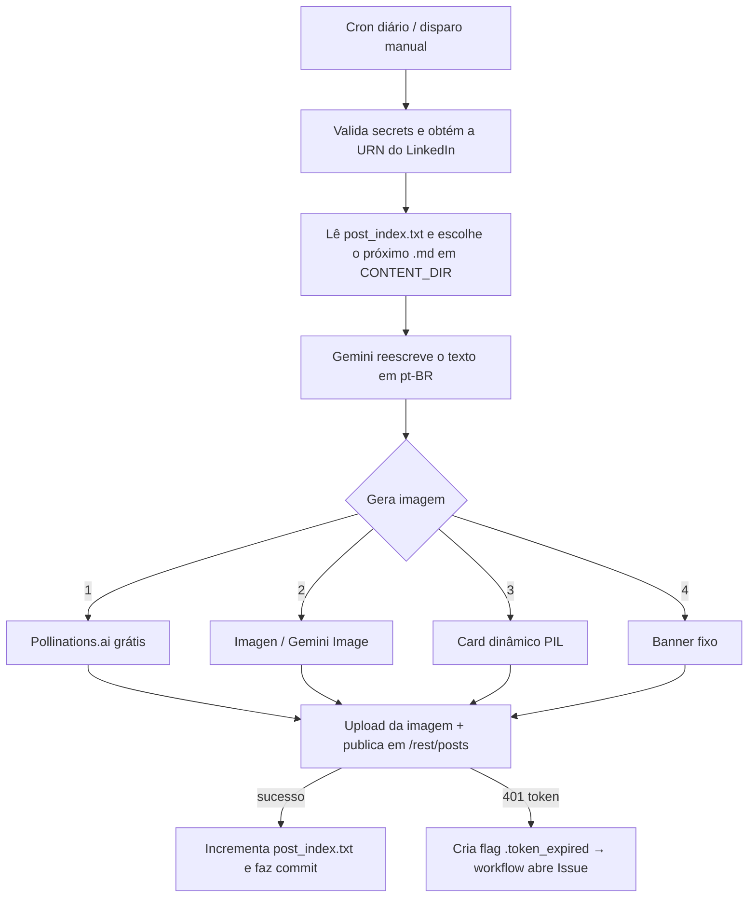

<!-- ══════════════════════ IDIOMAS / LANGUAGES ══════════════════════ -->
<div align="center">
<a href="README.md"></a>
<a href="README.en.md"></a>
<a href="README.es.md"></a>
</div>

<!-- ══════════════════════════ BANNER ══════════════════════════ -->
<div align="center">
  
</div>

<div align="center">
  
</div>

<div align="center">
  
</div>

<br/>

<h1 align="center">Automação de Posts no LinkedIn</h1>
<p align="center"><em>Um post por dia no LinkedIn, 100% autônomo — do Markdown à publicação, sem servidor e sem custo</em></p>
<p align="center"><strong>Anotação .md → Gemini reescreve → imagem por IA → LinkedIn API</strong></p>

<div align="center">


<br/>


</div>

<!-- ══════════════════════════ NAVEGAÇÃO ══════════════════════════ -->
<div align="center">

<a href="#sobre"></a>
<a href="#como-funciona"></a>
<a href="#tecnologias"></a>
<a href="#configuração"></a>
<a href="#uso"></a>

</div>

<br/>

> 💡 **Zero infraestrutura.** Roda inteiramente no **GitHub Actions** (cron diário + disparo manual) — sem servidor, sem custo, sem intervenção manual. Aponte a variável `CONTENT_DIR` para qualquer pasta de arquivos `.md` e o motor passa a postar o seu conteúdo.

<!-- ══════════════════════════ SOBRE ══════════════════════════ -->
## Sobre

Publica **um post por dia no LinkedIn** de forma autônoma, direto do GitHub Actions. A ferramenta pega anotações em Markdown, **reescreve o texto com IA** (Google Gemini) num tom profissional e em português do Brasil, **gera uma imagem de capa por IA** (com uma cascata de fallbacks para nunca falhar) e **publica pela API oficial do LinkedIn** — tudo agendado por um cron.

Foi criada para divulgar diariamente as anotações da pós em Segurança da Informação, mas o motor é **genérico**: qualquer pasta de `.md` vira uma fila de posts.

<!-- ══════════════════════════ DESTAQUES ══════════════════════════ -->
## Destaques de Engenharia

| Recurso | O que faz |
|---|---|
| **Reescrita com IA** | Gemini (`gemini-2.5-flash`) transforma a anotação em post de LinkedIn — prompt força pt-BR, remove markdown/emojis e "cara de IA" |
| **Imagem por IA com fallback em cascata** | 4 estratégias para o post **sempre** sair com capa |
| **Resiliência a falhas transitórias** | Retry com *backoff* exponencial; distingue erro transitório (503/429 → tenta de novo) de permanente (cota/plano pago → cai no fallback) |
| **Estado versionado** | `post_index.txt` guarda o índice do próximo post; avança a cada publicação e é commitado pelo próprio workflow — impossível dessincronizar |
| **Gestão do token** | O access token do LinkedIn dura ~60 dias e não tem refresh; ao expirar, o workflow **abre uma Issue** de lembrete |
| **Modo `dry_run`** | Monta o post inteiro (texto + imagem + payload) e **não publica**, para validar com segurança |

**Cascata de imagem** (da melhor à mais resiliente — o post nunca sai sem capa):

1. **Pollinations.ai** — IA gratuita, sem API key (fonte primária)
2. **Imagen / Gemini Image** — quando há billing
3. **Card dinâmico com PIL** — gradiente e cor variando por post
4. **Banner fixo de marca** — `assets/post_fallback.png`

<!-- ══════════════════════════ COMO FUNCIONA ══════════════════════════ -->
## Como Funciona



**Fluxo detalhado:**

1. Valida os secrets e chama `GET /v2/userinfo` para montar a URN do autor (detecta token expirado via 401).
2. Lê `post_index.txt` e varre `CONTENT_DIR` (`os.walk`) em busca do próximo `.md` — índice **circular** (ao terminar a lista, recomeça).
3. Envia o conteúdo ao **Gemini**, que reescreve como post de LinkedIn (hook, bullets, CTA, 3 hashtags, ≤1300 caracteres, sem emojis/markdown).
4. Gera a imagem de capa pela **cascata de fallback**.
5. Faz o upload da imagem (`/rest/images` → `initializeUpload` → `PUT` binário) e publica em **`/rest/posts`**.
6. Em caso de sucesso, incrementa e commita `post_index.txt`.

<!-- ══════════════════════════ TECNOLOGIAS ══════════════════════════ -->
## Tecnologias

<div>


</div>

| Camada | Tecnologia |
|---|---|
| Linguagem | Python 3.11 |
| Orquestração | GitHub Actions (cron + `workflow_dispatch`) |
| Reescrita de texto | Google Gemini (`google-genai`) |
| Imagem por IA | Pollinations.ai · Imagen/Gemini Image |
| Imagem fallback | Pillow (PIL) |
| Publicação | LinkedIn Posts API (`/rest/posts`) |
| HTTP | `requests` |

Dependências em [`requirements.txt`](requirements.txt): `google-genai`, `requests`, `Pillow`.

<!-- ══════════════════════════ CONFIGURAÇÃO ══════════════════════════ -->
## Configuração

**1. Secrets (obrigatórios)** — em **Settings → Secrets and variables → Actions**:

| Secret | Onde obter |
|---|---|
| `GEMINI_API_KEY` | [Google AI Studio](https://aistudio.google.com/app/apikey) |
| `LINKEDIN_ACCESS_TOKEN` | [LinkedIn OAuth Token Generator](https://www.linkedin.com/developers/tools/oauth/token-generator) — escopos `openid`, `profile`, `w_member_social` |

**2. Variáveis opcionais (com defaults):**

| Variável | Default | Função |
|---|---|---|
| `CONTENT_DIR` | `content` | Pasta raiz varrida em busca dos `.md` |
| `GEMINI_TEXT_MODEL` | `gemini-2.5-flash` | Modelo de reescrita de texto |
| `USE_POLLINATIONS` | `1` | Usa o Pollinations.ai como fonte primária de imagem |
| `POLLINATIONS_MODEL` | `flux` | Modelo do Pollinations (`flux`, `turbo`, …) |
| `DRY_RUN` | `0` | `1` = monta tudo mas **não** publica |
| `LINKEDIN_VERSION` | `202606` | Versão da LinkedIn API |
| `GEMINI_RETRY_MAX` / `_IMG` / `_BASE` | `5` / `3` / `2.0` | Parâmetros do retry com backoff |

**3. Conteúdo** — coloque seus arquivos `.md` em `content/` (ou aponte `CONTENT_DIR` para outra pasta). Subpastas são varridas recursivamente.

<!-- ══════════════════════════ USO ══════════════════════════ -->
## Uso

**Automático:** o workflow roda diariamente às **20:23 UTC (~17:23 BRT)** — configurável em [`.github/workflows/post_diario.yml`](.github/workflows/post_diario.yml).

**Manual / teste (não publica):**
```bash
gh workflow run post_diario.yml --ref main -f dry_run=true
```

**Local (não publica):**
```bash
pip install -r requirements.txt
DRY_RUN=1 CONTENT_DIR=content \
GEMINI_API_KEY="..." LINKEDIN_ACCESS_TOKEN="..." \
python automacao_linkedin.py
```

<!-- ══════════════════════════ TOKEN ══════════════════════════ -->
## Sobre o Token do LinkedIn

Apps de perfil pessoal do LinkedIn **não emitem refresh token**, então o access token (validade ~60 dias) é usado diretamente. Quando expira, o script cria a flag `.token_expired` e o workflow **abre uma Issue** de lembrete — basta gerar um novo token e atualizar o secret `LINKEDIN_ACCESS_TOKEN`.

<!-- ══════════════════════════ LICENÇA ══════════════════════════ -->
## Licença

[MIT](LICENSE).

<div align="center">
  
</div>

<p align="center"><sub>Desenvolvido por <strong><a href="https://github.com/douglascshun">Douglas Cshunderlick</a></strong> (r4bbi7) · Segurança da Informação · 2026</sub></p>
